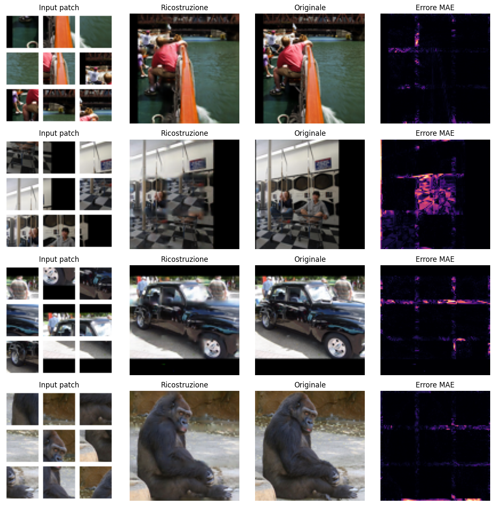

# Jigsaw Puzzle Reconstruction with Transformers

Reconstruct a 96×96 RGB image from **9 shuffled 28×28 patches** whose borders have been partially eroded. The model must figure out both **where each patch goes** and **how to fill the missing border content**, end-to-end, with no hand-crafted algorithms and no pretrained models.

Developed for the Deep Learning course of the MSc in Artificial Intelligence, University of Bologna.

*Columns: shuffled input patches · model reconstruction · original image · per-pixel MAE error map.*

## Results

| Model | Test MAE |
|---|---|
| Baseline (mean of input patches) | ≈ 0.18 |
| **This model** | **≈ 0.042** (std ≈ 0.046) |

Errors concentrate along patch borders, the information removed by erosion and the hardest part to recover.

## Approach

A single neural network in four stages (3.2M trainable parameters):

1. **Siamese CNN patch encoder** – the same convolutional encoder embeds each of the 9 patches (shared weights), producing a feature map and a 160-d token per patch.
2. **Transformer over patch tokens** – 6 Transformer blocks let patches "look at each other" to reason about how they fit together.
3. **Learned placement via attention** – 9 trainable slot queries (one per grid position) attend over the patch tokens, producing a soft patch-to-position assignment learned end-to-end, never given as input or supervised.
4. **Convolutional decoder** – the reordered feature grid is upsampled to 96×96, with a skip connection that reuses the raw RGB patches to reduce blur.

**Training:** STL-10 (100K unlabelled images), patches generated on the fly by a memory-efficient data generator, Adam (lr 3e-4) on MAE, learning-rate scheduling and checkpointing.

## Repository

- `jigsaw_reconstruction.ipynb` – full pipeline: data, generator, model, training, evaluation, examples.
- Trained weights are downloaded automatically via `gdown` (see the last notebook cell); set `TRAIN_FROM_SCRATCH = True` to retrain.

## Tech stack

Python · TensorFlow / Keras · NumPy · Matplotlib
